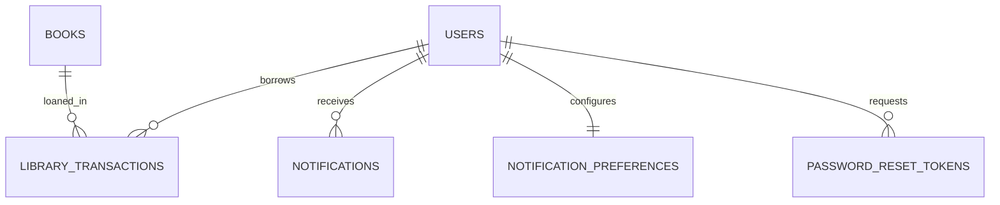

# Campus Library

A full-stack college library management system with a React/Vite client and Java 17/Spring Boot API backed by MySQL 8.

## Features

- Member registration, BCrypt password hashing, JWT login, profile/password updates, one-hour password reset tokens.
- Member and librarian routes with role authorization enforced in Spring Security.
- Partial book search, pagination, librarian create/edit/delete, membership management.
- Transactional borrowing and returns, database row locking for copy availability, borrowing limits, due dates, overdue fines.
- Member history and dashboard, librarian inventory/borrowing analytics, in-app notifications, preferences, mail, scheduled reminders.
- Responsive React UI, charts, loading/empty/error states, Swagger/OpenAPI, and deployment configuration.

## Technology and architecture

Frontend: React 18, Vite, Tailwind CSS, React Router, Axios, React Hook Form, Recharts, Lucide React. Backend: Java 17+, Spring Boot Web, Data JPA, Security, Validation, Mail, BCrypt, JWT, Lombok, springdoc. Database: MySQL 8.

`frontend/src` contains pages, reusable layout, auth context, and API service. `backend/src/main/java/com/library` separates controllers, services, repositories, entities, security, and exceptions.

## Database schema and relationships

Run `database/schema.sql` to create the database and tables. Local development uses Hibernate `update`; deployments should apply schema changes and set `DDL_AUTO=validate`.



No default password is shipped. Bootstrap the first librarian through environment variables.

## API documentation

Swagger UI: `http://localhost:8080/swagger-ui.html`; OpenAPI document: `/v3/api-docs`.

| Area | Main routes |
|---|---|
| Authentication | `POST /api/auth/register`, `/login`, `/forgot-password`, `/reset-password`; `GET /me`; `PUT /profile`, `/password` |
| Books | `GET /api/books?q=&page=&size=`, `GET /{id}`, librarian `POST`, `PUT /{id}`, `DELETE /{id}` |
| Members | Librarian `GET/POST /api/members`, `GET/PUT/DELETE /{id}`, `GET /{id}/history` |
| Transactions | Member `POST /api/transactions/borrow`, `POST /{id}/return`, `GET /my-history`; librarian `GET /api/transactions` |
| Notifications | `GET /api/notifications`, `PUT /{id}/read`, `/read-all`, `DELETE /{id}`, librarian `POST /send`; `GET/PUT /preferences` |
| Reports | Librarian `GET /api/reports/inventory`, `/borrowing`, `/popular-books`, `/active-members`, `/dashboard` |

Protected calls use `Authorization: Bearer <token>`. Registration always creates a MEMBER and ignores any role supplied by a client.

## Requirements

Java 17+, Maven 3.9+, Node.js 20+, npm, MySQL 8+.

## Installation and run

1. Create the database and tables:

   ```bash
   mysql -u root -p < database/schema.sql
   ```

2. Copy root `.env.example` to `.env`, configure credentials and secrets. Spring Boot does not load root `.env` automatically; export these values in your shell, IDE, or deployment environment.

3. Start the backend:

   ```bash
   cd backend
   mvn spring-boot:run
   ```

4. Start the frontend in another terminal:

   ```bash
   cd frontend
   copy .env.example .env
   npm install
   npm run dev
   ```

The frontend runs at `http://localhost:5173`; the API at `http://localhost:8080`.

## Environment and deployment

See root `.env.example` and `frontend/.env.example`. The backend uses `DB_URL`, `DB_USERNAME`, `DB_PASSWORD`, `JWT_SECRET`, `MAIL_HOST`, `MAIL_PORT`, `MAIL_USERNAME`, `MAIL_PASSWORD`, `FRONTEND_URL`, and borrowing/reminder settings. Set `JWT_SECRET` to a random value of at least 32 bytes. `FRONTEND_URL` defines the allowed CORS origin.

- Vercel: deploy `frontend/`, set `VITE_API_URL` to the deployed backend base ending in `/api`. `vercel.json` supports client-side routing.
- Render/Railway: deploy `backend/` as a Java 17 service, set runtime environment variables, and use managed MySQL 8.
- Apply the SQL schema and set `DDL_AUTO=validate` in production. Do not use the development fallback JWT key.

Optional bootstrap librarian variables are `BOOTSTRAP_LIBRARIAN_EMAIL` and `BOOTSTRAP_LIBRARIAN_PASSWORD` (minimum 12 characters). The account is created once if the email is not already present.

## Testing

Run `cd backend && mvn test` and `cd frontend && npm run build`. The backend includes Spring test dependencies; broader API/UI flow tests can be added as the project expands.

## Default accounts and screenshots

No default account credentials are included. Configure the initial librarian via bootstrap variables; members register in the app. Run the app locally to capture current screenshots. The landing page and authenticated dashboards use a responsive academic design with live API values and charts.

## Future improvements

Add Flyway migrations, persisted search history, richer date-range report filters, durable email retries, and automated end-to-end browser tests.
